# 30-days-of-udacity-computer-vision
## My pledge "30 days of udacity" for the Computer Vision nanodegree.

## Day 1: September 24, 2019
- I entered the Computer Vision nanodegree.
- I answered the initial survey of my Computer Vision nanodegree.
- I establish contact with my mentor Ricardo R.
- I started my pledge "30 Days of Udacity" for the Computer Vision nanodegree.
- I started my personal pledge "4 Months of Udacity" for the Phase 2 of the Secure and Private AI Challenge: https://github.com/jckuri/4-months-of-udacity-spaic-2

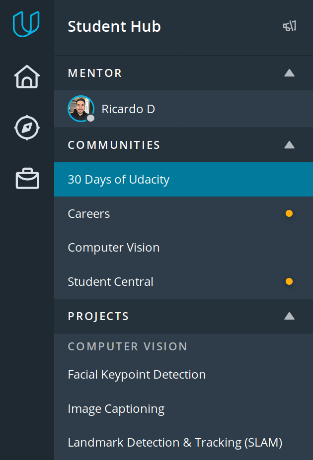

## Day 2: September 25, 2019
- I watched many video lectures.
- Now I'm in **Part 1: Introduction to Computer Vision** (Progress 26%); **Lesson 4: Image Representation & Classification; 19. Day and Night Classification**

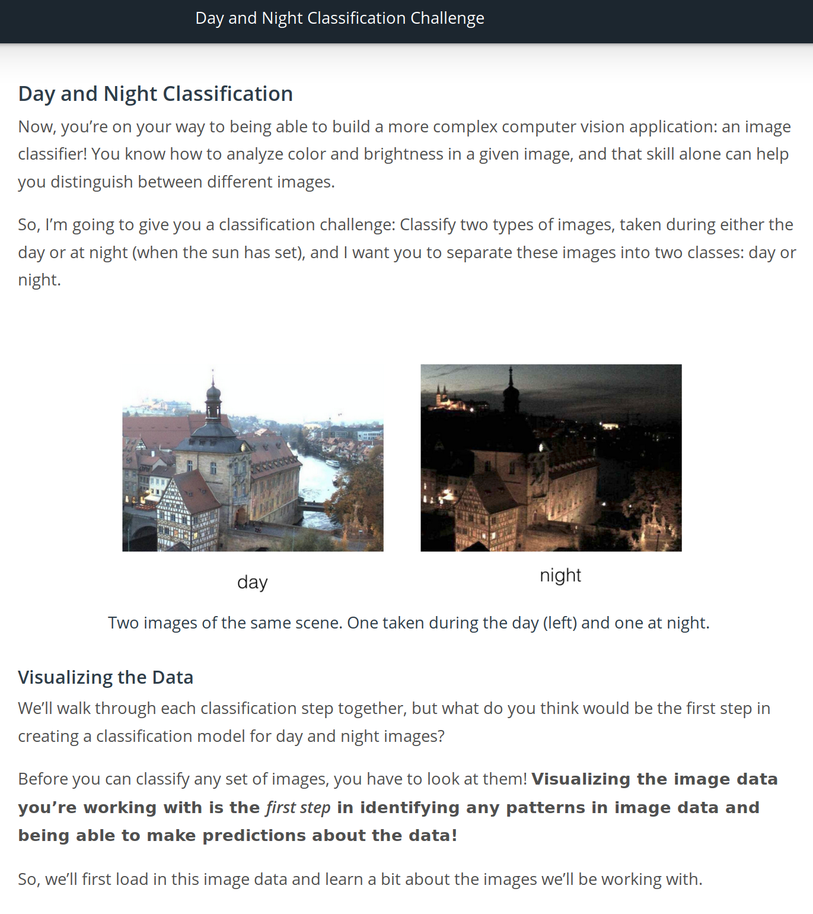

## Day 3: September 26, 2019
- I watched many video lectures and programmed functions in many Jupyter notebooks.
- Now I'm in **Part 1: Introduction to Computer Vision** (Progress 46%); **Lesson 5: Convolutional Filters and Edge Detection**  (Progress 73%); **19. Quiz: Hough Space**
- I encourage @KhushkumarP, @Jacqueline SusanM.

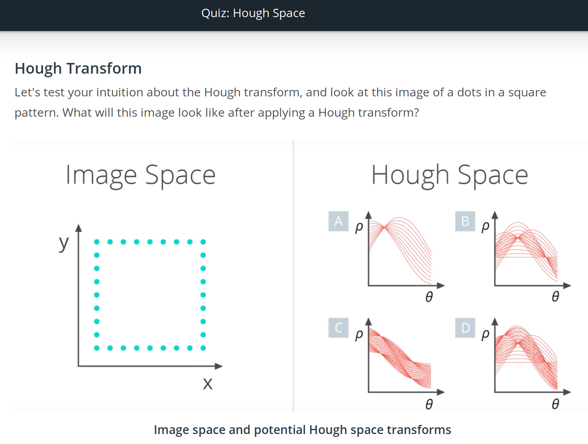

## Day 4: September 27, 2019
- I filled the form of the #30DaysofUdacity pledge. 
- I watched many video lectures and programmed functions in many Jupyter notebooks.
- Now I'm in **Part 1: Introduction to Computer Vision** (Progress 81%); **Lesson 8: CNN Layers and Feature Visualization**  (Progress 76%); **22. Visualizing CNNs (Part 2)**
- I encourage @KhushkumarP, @Jacqueline SusanM, @labibaR, @OudarjyaS.

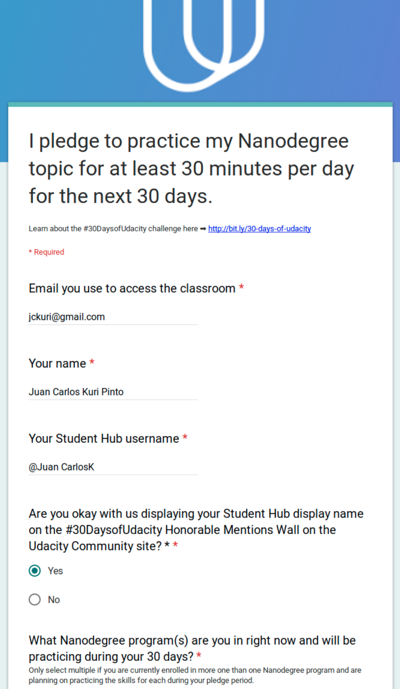
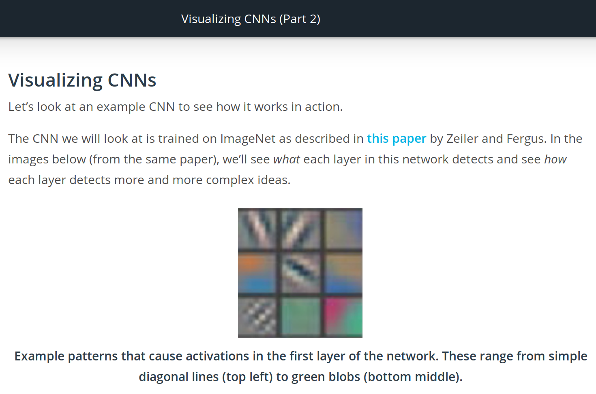

## Day 5: September 28, 2019
- I watched many video lectures and programmed functions in many Jupyter notebooks.
- Now I'm in **Part 1: Introduction to Computer Vision** (Progress 88%); **Project: Facial Keypoint Detection**; **3. Project: Facial Keypoint Detection**
- I'm working on **Project 1: Facial Keypoint Detection**. So far, my average loss is 0.0011, which is good.
- I encourage @KhushkumarP, @Jacqueline SusanM, @labibaR, @OudarjyaS, @MuhammadN, @Mohamed ChoukriB. 

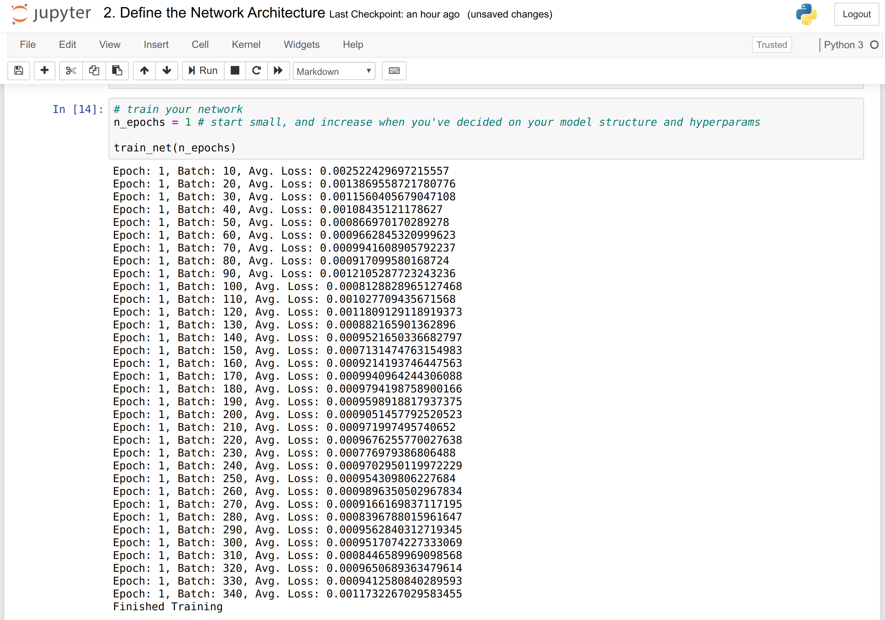

## Day 6: September 29, 2019
- I'm about to submit the **Project 1: Facial Keypoint Detection**. So far, the results are good. See the attached photo.
- I'm in **Part 1: Introduction to Computer Vision** (Progress 88%); **Project: Facial Keypoint Detection**; **3. Project: Facial Keypoint Detection**
- I encourage @KhushkumarP, @Jacqueline SusanM, @labibaR, @OudarjyaS, @MuhammadN, @Mohamed ChoukriB, @KonstantinosK, @AdityaK, @MahmmoudM . 

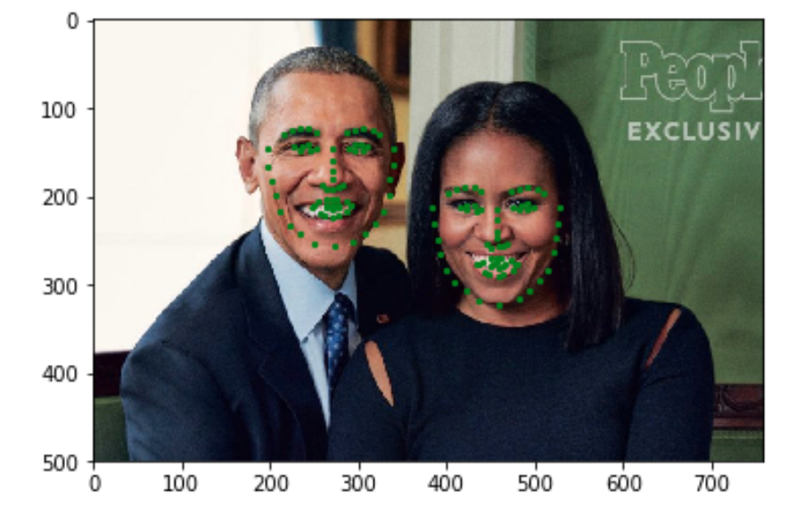

## Day 7: September 30, 2019
- I've succesfully passed **Project 1: Facial Keypoint Detection.**
- I'm in **Part 1: Introduction to Computer Vision** (Progress 95%); **Project: Optimize Your GitHub Profile**; **9. Writing READMEs with Walter**
- I encourage @KhushkumarP, @Jacqueline SusanM, @labibaR, @OudarjyaS, @MuhammadN, @Mohamed ChoukriB, @KonstantinosK, @AdityaK, @MahmmoudM. 

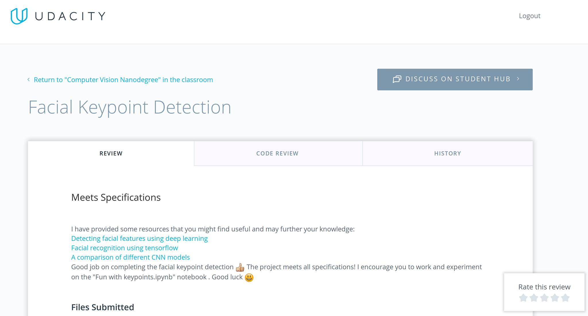
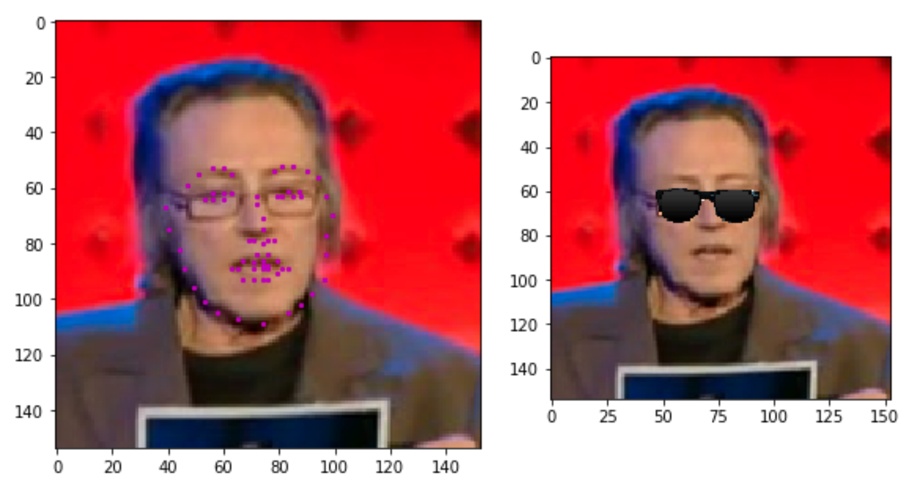

## Day 8: October 1, 2019
- I've submitted the **Project - Optimize Your GitHub Profile** and received feedback about my submission.
- I've completed **Part 1: Introduction to Computer Vision** (Progress 100 %)
- I've completed **Part 2: Optional - Cloud Computing** (Progress 100 %)
- I'm in **Part 3: Advanced Computer Vision & Deep Learning** (Progress 17 %); **Lesson 2: YOLO** (Progress 40 %); **6. Training on a Grid**
- I encourage @KhushkumarP, @Jacqueline SusanM, @labibaR, @OudarjyaS, @MuhammadN, @Mohamed ChoukriB, @KonstantinosK, @AdityaK, @MahmmoudM. 

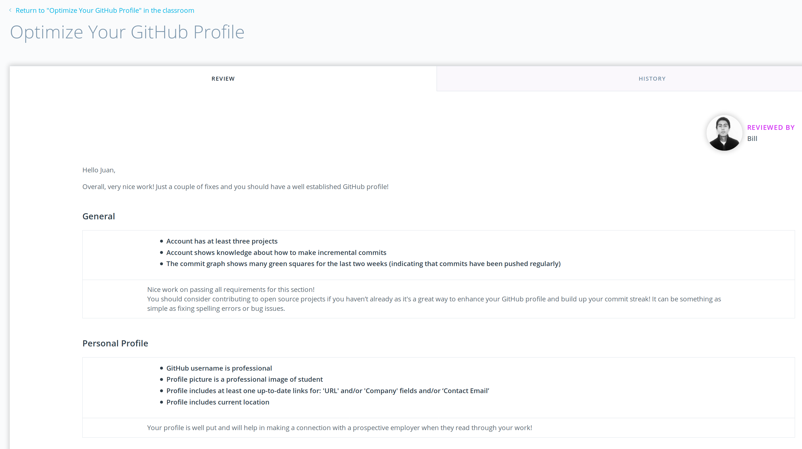
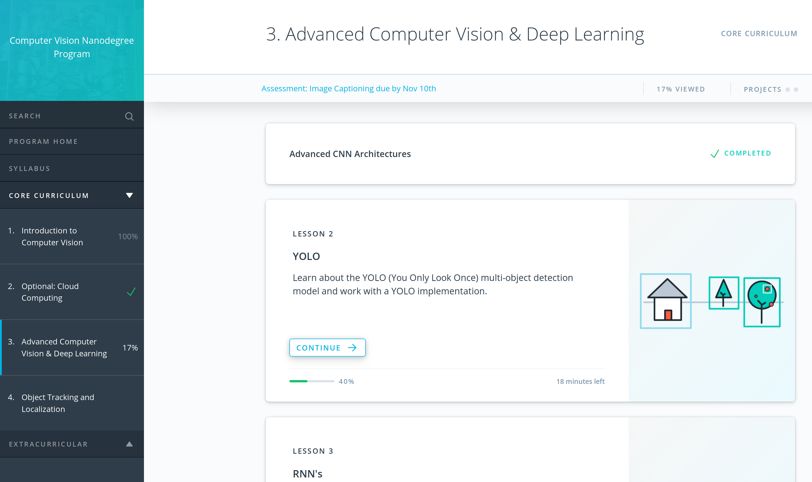

## Day 9: October 2, 2019
- I watched many video lectures and programmed functions in many Jupyter notebooks.
- I'm in **Part 3: Advanced Computer Vision & Deep Learning** (Progress 31%); **Lesson 3: RNN's** (Progress 31%); **8. Backpropagation- Theory**
- I encourage @KhushkumarP, @Jacqueline SusanM, @labibaR, @OudarjyaS, @MuhammadN, @Mohamed ChoukriB, @KonstantinosK, @AdityaK, @MahmmoudM, @LauraT, @ElenaK, @HelenaB. 

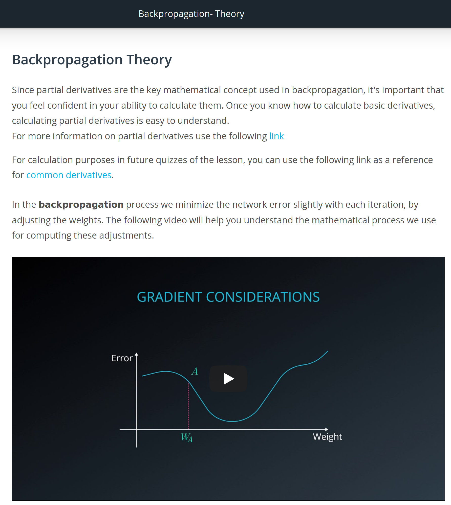

## Day 10: October 3, 2019
- I watched many video lectures and programmed functions in many Jupyter notebooks.
- I'm in **Part 3: Advanced Computer Vision & Deep Learning** (Progress 54%); **Lesson 4: Long Short-Term Memory Networks (LSTMs)** (Progress 69%); **11. Quiz**
- I encourage @KhushkumarP, @Jacqueline SusanM, @labibaR, @OudarjyaS, @MuhammadN, @Mohamed ChoukriB, @KonstantinosK, @AdityaK, @MahmmoudM, @LauraT, @ElenaK, @HelenaB. 

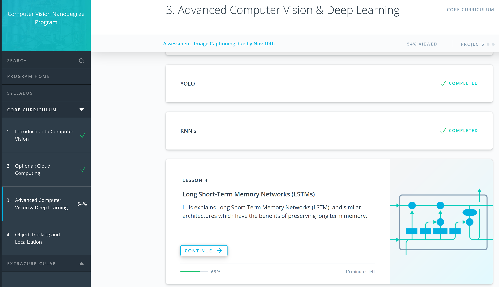

## Day 11: October 4, 2019
- I watched many video lectures and programmed functions in many Jupyter notebooks.
- I'm in **Part 3: Advanced Computer Vision & Deep Learning** (Progress 91%); **Project: Image Captioning**
- I encourage @KhushkumarP, @Jacqueline SusanM, @labibaR, @OudarjyaS, @MuhammadN, @Mohamed ChoukriB, @KonstantinosK, @AdityaK, @MahmmoudM, @LauraT, @ElenaK, @HelenaB, @RobO, @ShafaqA. 

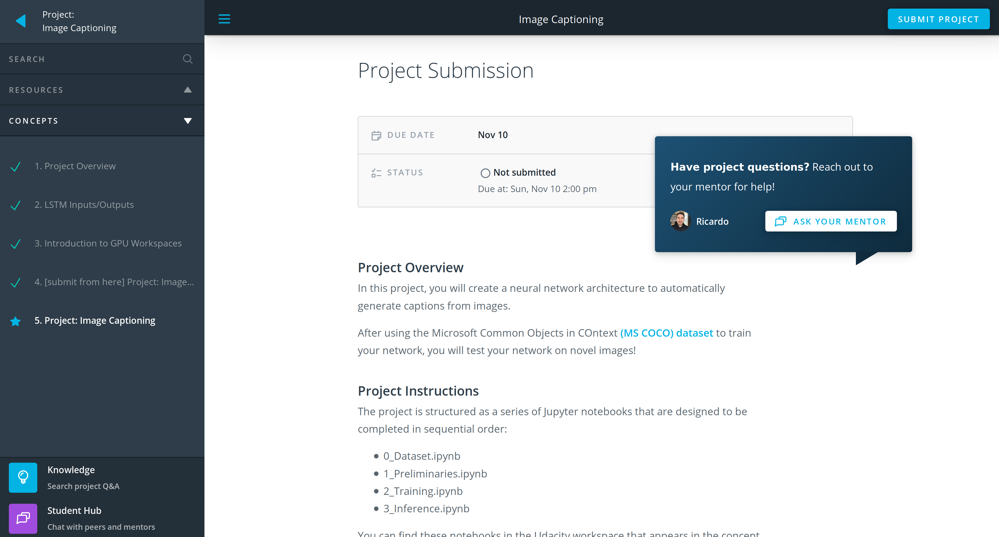

## Day 12: October 5, 2019
- I had a virtual meetup with the people of the Deep Learning nanodegree.
- I had a virtual meetup with the people of the Computer Vision nanodegree.
- I'm in **Part 3: Advanced Computer Vision & Deep Learning** (Progress 91%); **Project: Image Captioning**
- I'm programming **Project 2: Image Captioning.** However, I'm stuck because the COCO dataset is tricky to install. Perhaps I should work in the Udacity website.
- I encourage @KhushkumarP, @Jacqueline SusanM, @labibaR, @OudarjyaS, @MuhammadN, @Mohamed ChoukriB, @KonstantinosK, @AdityaK, @MahmmoudM, @LauraT, @ElenaK, @HelenaB, @RobO, @ShafaqA. 

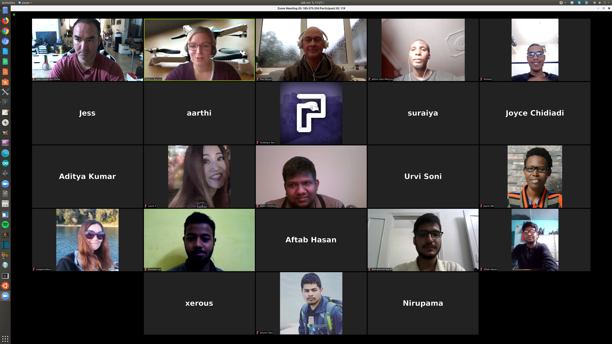
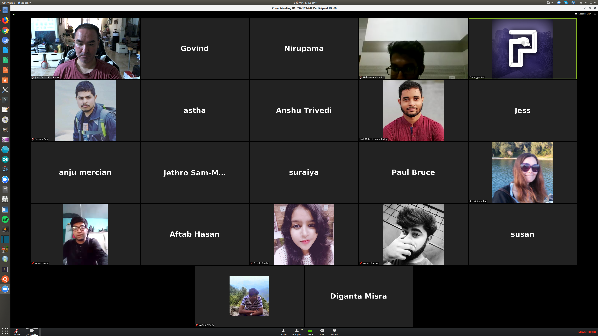

## Day 13: October 6, 2019
- I'm in **Part 3: Advanced Computer Vision & Deep Learning** (Progress 91%); **Project: Image Captioning**
- I'm programming **Project 2: Image Captioning.** I finally understood the CNN Encoder and the RNN Decoder. I already programmed the RNN Decoder and I selected good-enough hyperparameters to train my neural networks. The learning curve is slowly and steadily converging, almost monotonically with minor jumps in the loss. See the photo. But it takes ages to train in the Udacity's GPU. I hope my 50 hours of GPU won't be consumed too fast.
- I encourage @KhushkumarP, @Jacqueline SusanM, @labibaR, @OudarjyaS, @MuhammadN, @Mohamed ChoukriB, @KonstantinosK, @AdityaK, @MahmmoudM, @LauraT, @ElenaK, @HelenaB, @RobO, @ShafaqA. 

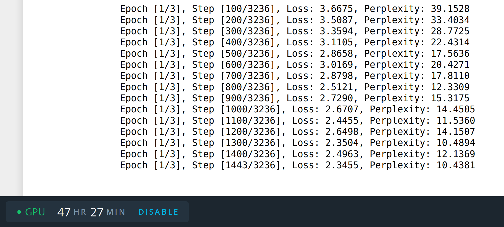

## Day 14: October 7, 2019
- I'm in **Part 3: Advanced Computer Vision & Deep Learning** (Progress 91%); **Project: Image Captioning**
- I just submitted my **Project 2: Image Captioning.** *(Crossing fingers.)* I'm deeply impressed by the results. See the photos.
- UPDATE: I successfully passed my **Project 2: Image Captioning.**
- I encourage @KhushkumarP, @Jacqueline SusanM, @labibaR, @OudarjyaS, @MuhammadN, @Mohamed ChoukriB, @KonstantinosK, @AdityaK, @MahmmoudM, @LauraT, @ElenaK, @HelenaB, @RobO, @ShafaqA. 

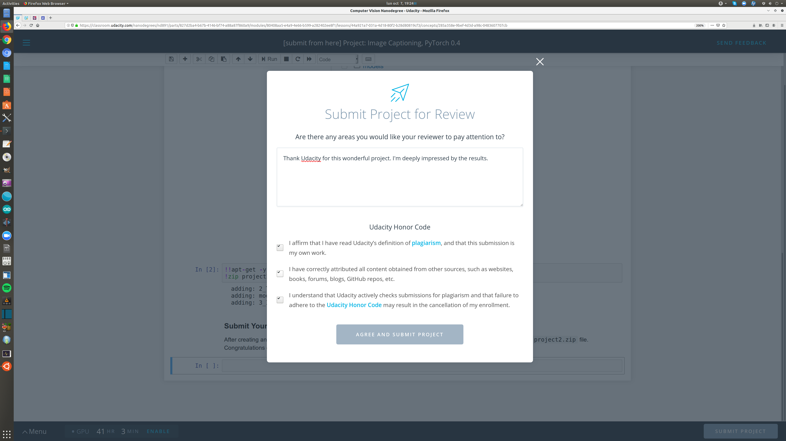
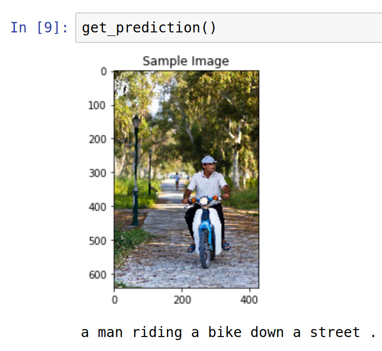
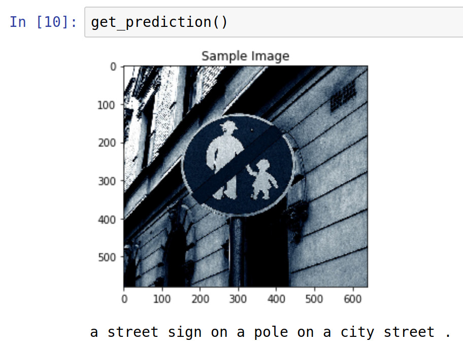
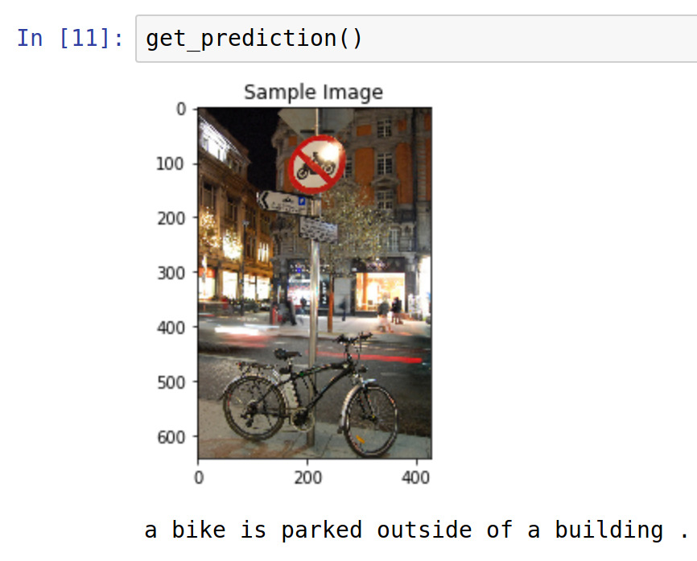
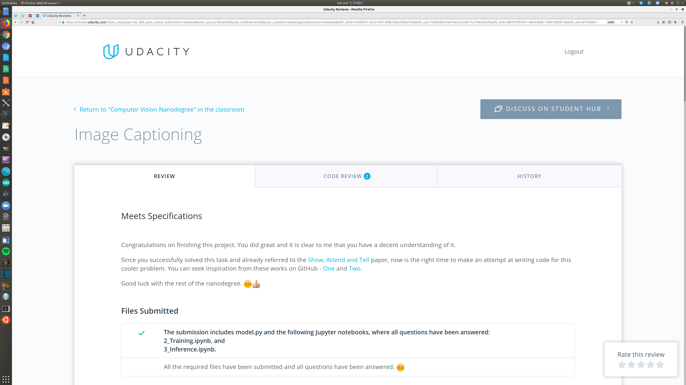

## Day 15: October 8, 2019
- I submitted my **Project: Improve Your LinkedIn Profile**. I passed it and a project reviewer gave me extensive feedback to improve my LinkedIn profile.
- I'm in **Part 4: Object Tracking and Localization** (Progress 15%); **Lesson 2 - Robot Localization** (Progress 50%); **19. Notebook: Multiple Measurements**
- So far, I've succesfully passed:
  - Project 1: Facial Keypoint Detection;
  - Project - Optimize Your GitHub Profile;
  - Project 2: Image Captioning;
  - and Project: Improve Your LinkedIn Profile.
- I encourage @KhushkumarP, @Jacqueline SusanM, @labibaR, @OudarjyaS, @MuhammadN, @Mohamed ChoukriB, @KonstantinosK, @AdityaK, @MahmmoudM, @LauraT, @ElenaK, @HelenaB, @RobO, @ShafaqA. 

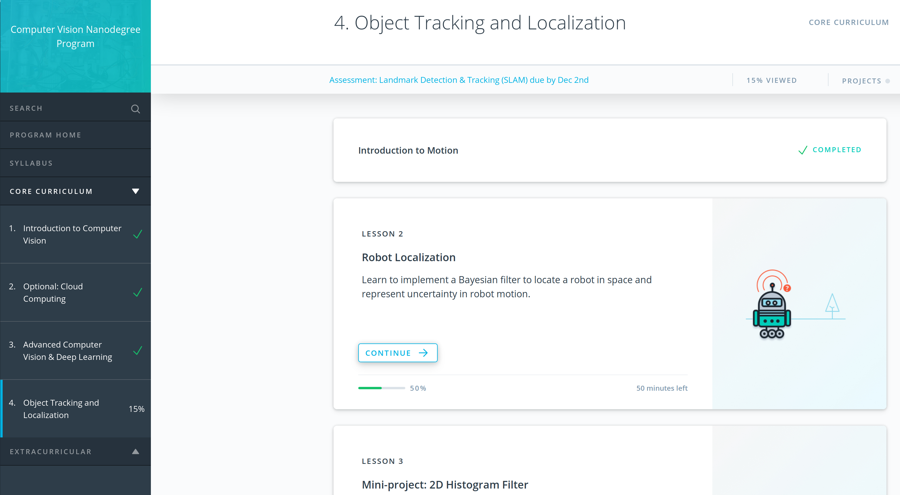
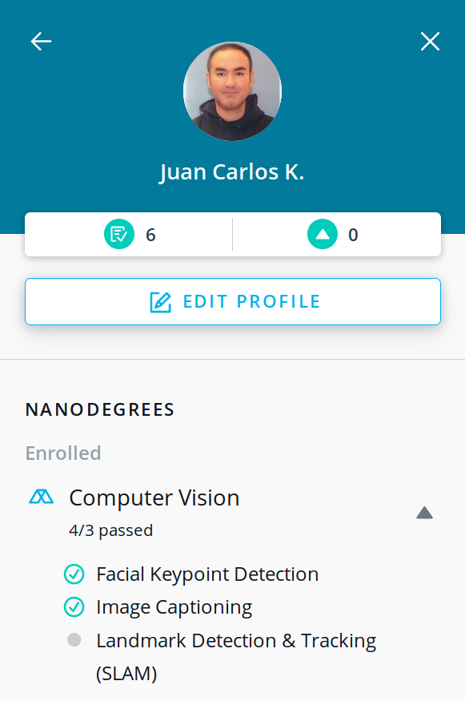

## Day 16: October 9, 2019
- I'm in **Part 4: Object Tracking and Localization** (Progress 67%); **Lesson 6 - Matrices and Transformation of State** (Progress 74%); **23. Matrix Multiplication**
- I encourage @KhushkumarP, @Jacqueline SusanM, @labibaR, @OudarjyaS, @MuhammadN, @Mohamed ChoukriB, @KonstantinosK, @AdityaK, @MahmmoudM, @LauraT, @ElenaK, @HelenaB, @RobO, @ShafaqA. 

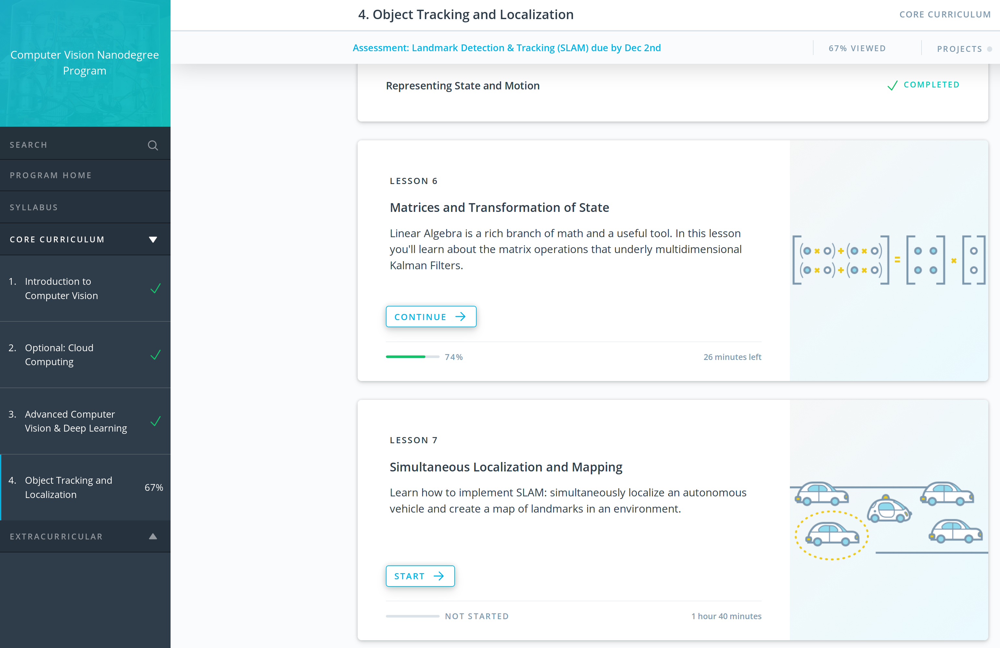

## Day 17: October 10, 2019
- I finish watching all the video lectures of the core curriculum:
  - **Part 1: Introduction to Computer Vision** (Progress 100%);
  - **Part 2: Optional - Cloud Computing** (Progress 100%);
  - **Part 3: Advanced Computer Vision & Deep Learning** (Progress 100%);
  - **Part 4: Object Tracking and Localization** (Progress 100%).
- I'm working in the final project: **Project 3 - Landmark Detection & Robot Tracking (SLAM)**
- I encourage @KhushkumarP, @Jacqueline SusanM, @labibaR, @OudarjyaS, @MuhammadN, @Mohamed ChoukriB, @KonstantinosK, @AdityaK, @MahmmoudM, @LauraT, @ElenaK, @HelenaB, @RobO, @ShafaqA, @Nancy A. 

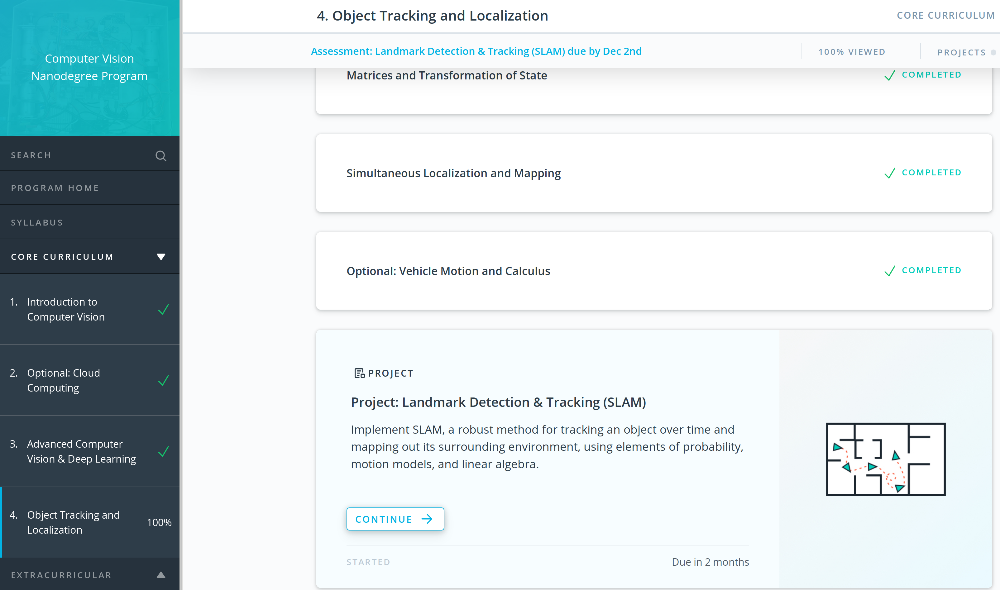

## Day 18: October 11, 2019
- I submitted and passed the Project 3 - Landmark Detection & Robot Tracking (SLAM).
- **I graduated from the Computer Vision nanodegree.**
- I encourage @KhushkumarP, @Jacqueline SusanM, @labibaR, @OudarjyaS, @MuhammadN, @Mohamed ChoukriB, @KonstantinosK, @AdityaK, @MahmmoudM, @LauraT, @ElenaK, @HelenaB, @RobO, @ShafaqA, @Nancy A. 

## Day 19: October 12, 2019
- I attended the virtual meetup of Deep Learning.
- I attended the virtual meetup of Computer Vision.
- I applied to the role of technical moderator of the Slack channel #cvnd_techhelp.
- I encourage @KhushkumarP, @Jacqueline SusanM, @labibaR, @OudarjyaS, @MuhammadN, @Mohamed ChoukriB, @KonstantinosK, @AdityaK, @MahmmoudM, @LauraT, @ElenaK, @HelenaB, @RobO, @ShafaqA, @Nancy A. 

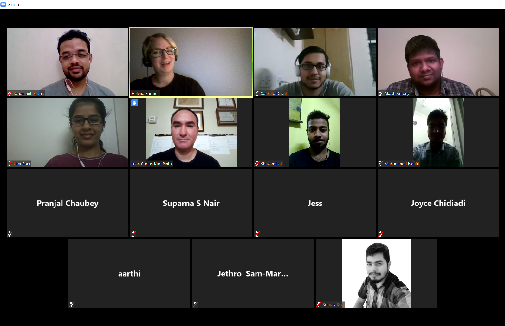
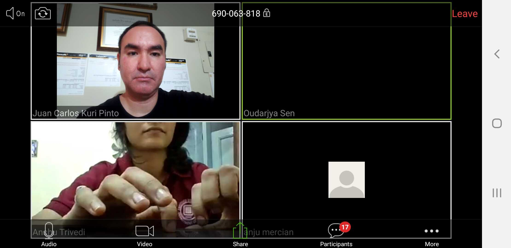
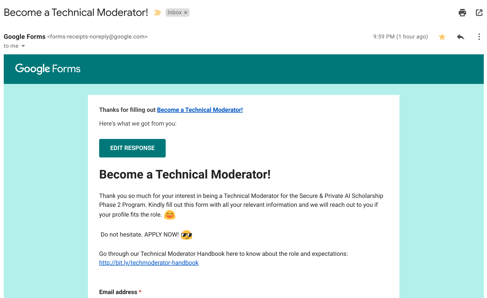

## Day 20: October 13, 2019
- I'm watching all the video lectures of the extracurricular material.
- I'm in **Part 2. Review: Training A Neural Network** (Progress 10%); **Lesson 1 - Feedforward and Backpropagation** (Progress 60%); **3. Neural Network Architecture.**
- I encourage @KhushkumarP, @Jacqueline SusanM, @labibaR, @OudarjyaS, @MuhammadN, @Mohamed ChoukriB, @KonstantinosK, @AdityaK, @MahmmoudM, @LauraT, @ElenaK, @HelenaB, @RobO, @ShafaqA, @Nancy A. 

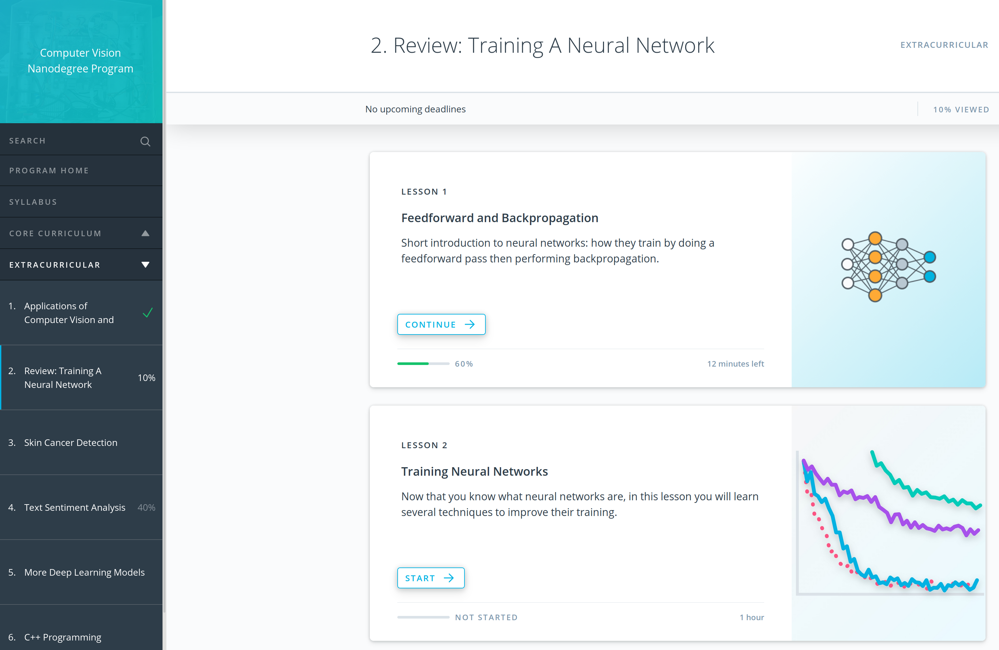

## Day 21: October 14, 2019
- I'm watching all the video lectures of the extracurricular material.
- I'm in **Part 2. Review: Training A Neural Network** (Progress 16%); **Lesson 1 - Feedforward and Backpropagation** (Progress 100%); **5. Backpropagation**
- I applied to the Bertelsmann Technology Scholarship Program. I selected the Artificial Intelligence track. See the photo.
- I encourage @KhushkumarP, @Jacqueline SusanM, @labibaR, @OudarjyaS, @MuhammadN, @Mohamed ChoukriB, @KonstantinosK, @AdityaK, @MahmmoudM, @LauraT, @ElenaK, @HelenaB, @RobO, @ShafaqA, @Nancy A. 

## Day 22: October 15, 2019
- I'm watching all the video lectures of the extracurricular material.
- I'm in **Part 2. Review: Training A Neural Network** (Progress 41%); **Lesson 2 - Training Neural Networks** (Progress 50%); **8. Dropout**
- I encourage @KhushkumarP, @Jacqueline SusanM, @labibaR, @OudarjyaS, @MuhammadN, @Mohamed ChoukriB, @KonstantinosK, @AdityaK, @MahmmoudM, @LauraT, @ElenaK, @HelenaB, @RobO, @ShafaqA, @Nancy A. 

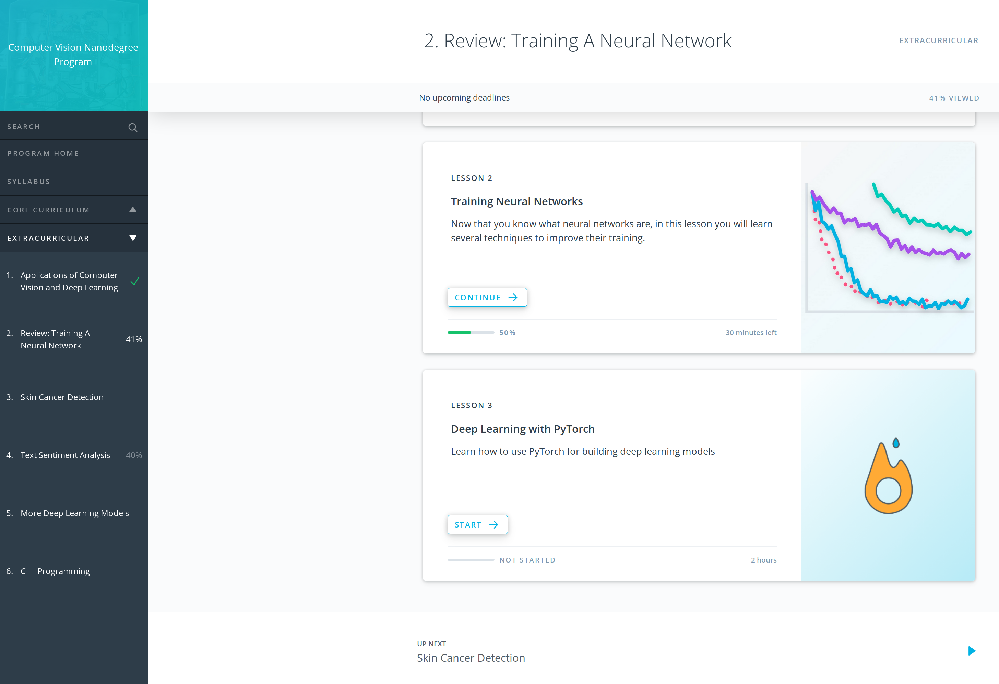

## Day 23: October 16, 2019
- I was selected as technical moderator of computer vision in the Slack channel #cvnd_techhelp of the Phase 2 of the Secure & Private Artificial Intelligence Challenge (SPAIC). See the photo.
- I applied to become a mentor of the Computer Vision nanodegree. **crossing fingers**
- I'm watching all the video lectures of the extracurricular material.
- I'm in **Part 2. Review: Training A Neural Network** (Progress 75%); **Lesson 3 - Deep Learning with PyTorch** (Progress 27%); **3. PyTorch Tensors**
- I encourage @KhushkumarP, @Jacqueline SusanM, @labibaR, @OudarjyaS, @MuhammadN, @Mohamed ChoukriB, @KonstantinosK, @AdityaK, @MahmmoudM, @LauraT, @ElenaK, @HelenaB, @RobO, @ShafaqA, @Nancy A. 

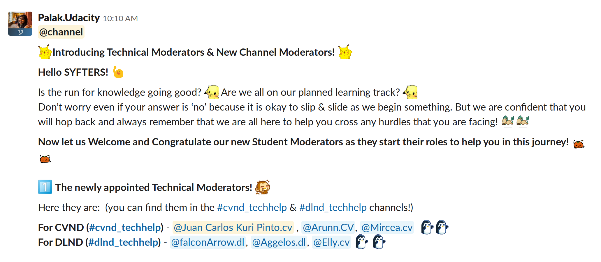

## Day 24: October 17, 2019
- I'm watching all the video lectures of the extracurricular material.
- I'm in **Part 2. Review: Training A Neural Network** (Progress 82%); **Lesson 3 - Deep Learning with PyTorch** (Progress 45%); **5. Training Networks**
- I encourage @KhushkumarP, @Jacqueline SusanM, @labibaR, @OudarjyaS, @MuhammadN, @Mohamed ChoukriB, @KonstantinosK, @AdityaK, @MahmmoudM, @LauraT, @ElenaK, @HelenaB, @RobO, @ShafaqA, @Nancy A. 

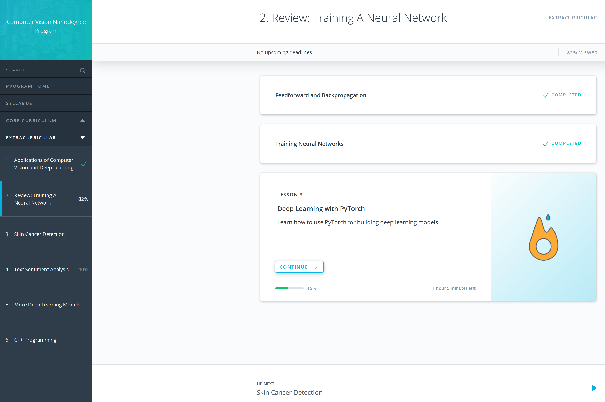

## Day 25: October 18, 2019
- I'm watching all the video lectures of the extracurricular material.
- I'm in **Part 2. Review: Training A Neural Network** (Progress 88%); **Lesson 3 - Deep Learning with PyTorch** (Progress 64%); **7. Inference & Validation**
- I encourage @KhushkumarP, @Jacqueline SusanM, @labibaR, @OudarjyaS, @MuhammadN, @Mohamed ChoukriB, @KonstantinosK, @AdityaK, @MahmmoudM, @LauraT, @ElenaK, @HelenaB, @RobO, @ShafaqA, @Nancy A. 

## Day 26: October 19, 2019
- I'm watching all the video lectures of the extracurricular material.
- I'm in **Part 2. Review: Training A Neural Network** (Progress 94%); **Lesson 3 - Deep Learning with PyTorch** (Progress 82%); **9. Loading Data Sets with Torchvision**
- I encourage @KhushkumarP, @Jacqueline SusanM, @labibaR, @OudarjyaS, @MuhammadN, @Mohamed ChoukriB, @KonstantinosK, @AdityaK, @MahmmoudM, @LauraT, @ElenaK, @HelenaB, @RobO, @ShafaqA, @Nancy A, @TzuhsinC, @TemitopeO, @AarthiA, @NabhanA, @MD BAPPIP, @AnkitV. 

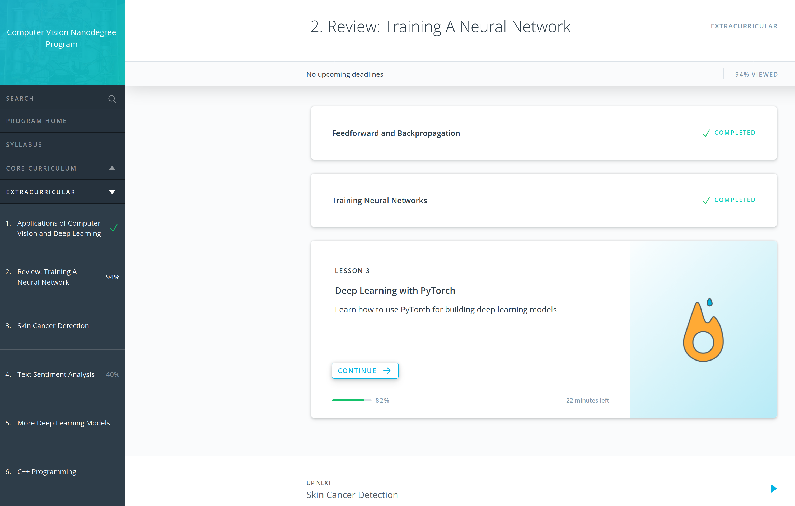

## Day 27: October 20, 2019
- I'm watching all the video lectures of the extracurricular material.
- I'm in **Part 2. Review: Training A Neural Network** (Progress 100%); **Lesson 3 - Deep Learning with PyTorch** (Progress 100%); **11. Transfer Learning Solution**
- I encourage @KhushkumarP, @Jacqueline SusanM, @labibaR, @OudarjyaS, @MuhammadN, @Mohamed ChoukriB, @KonstantinosK, @AdityaK, @MahmmoudM, @LauraT, @ElenaK, @HelenaB, @RobO, @ShafaqA, @Nancy A, @TzuhsinC, @TemitopeO, @AarthiA, @NabhanA, @MD BAPPIP, @AnkitV. 

## Day 28: October 21, 2019
- I'm watching all the video lectures of the extracurricular material.
- Today I ran a local simulation of the AWS DeepRacer in my computer. The deadline for the final race is close.
- I encourage @KhushkumarP, @Jacqueline SusanM, @labibaR, @OudarjyaS, @MuhammadN, @Mohamed ChoukriB, @KonstantinosK, @AdityaK, @MahmmoudM, @LauraT, @ElenaK, @HelenaB, @RobO, @ShafaqA, @Nancy A, @TzuhsinC, @TemitopeO, @AarthiA, @NabhanA, @MD BAPPIP, @AnkitV. 

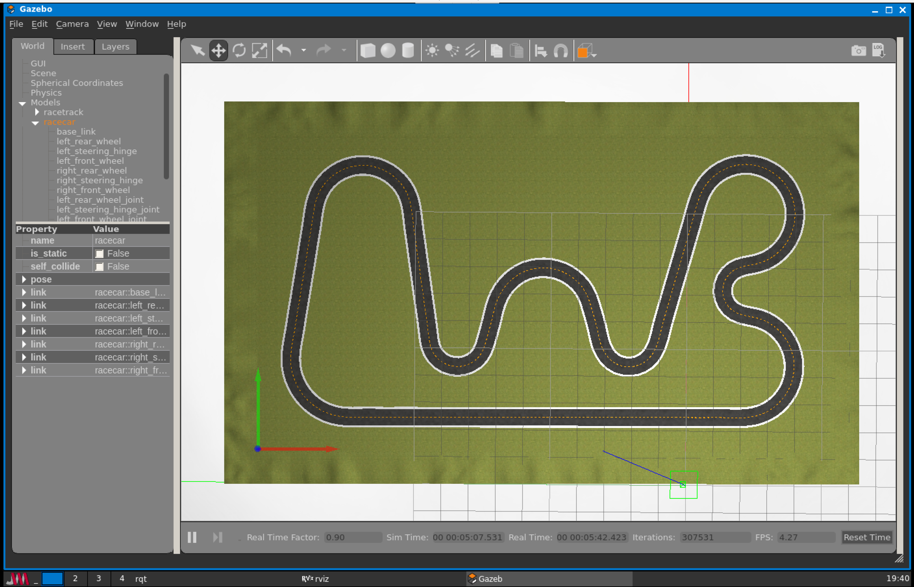
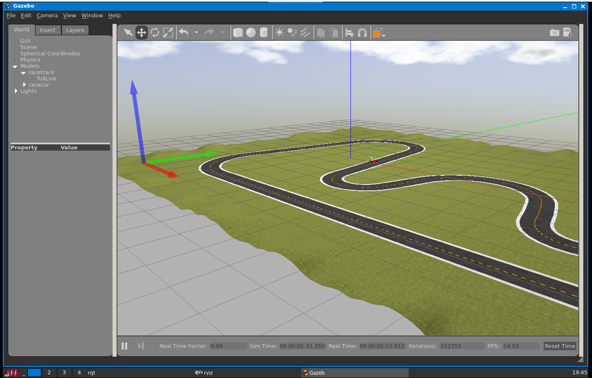

## Day 29: October 22, 2019
- I'm watching all the video lectures of the extracurricular material.
- Today I programmed part of my vectorial field of rewards for AWS DeepRacer. See the photo. The deadline for the final race is close.
- I encourage @KhushkumarP, @Jacqueline SusanM, @labibaR, @OudarjyaS, @MuhammadN, @Mohamed ChoukriB, @KonstantinosK, @AdityaK, @MahmmoudM, @LauraT, @ElenaK, @HelenaB, @RobO, @ShafaqA, @Nancy A, @TzuhsinC, @TemitopeO, @AarthiA, @NabhanA, @MD BAPPIP, @AnkitV. 

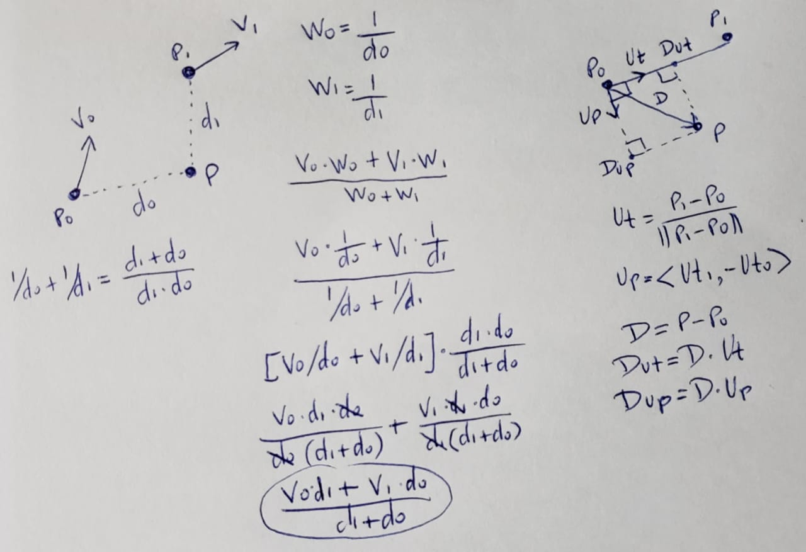

## Day 30: October 23, 2019
- I'm watching all the video lectures of the extracurricular material.
- I'm still programming my vectorial field of rewards for AWS DeepRacer. The deadline for the final race is close.
- I'm reading some links about fully convolutional neural networks and semantic segmentation, given that there is a lesson about it in the extracurricular section. See the photo.
- I answered some questions in the Slack channel #cvnd_techhelp.
- I encourage @KhushkumarP, @Jacqueline SusanM, @labibaR, @OudarjyaS, @MuhammadN, @Mohamed ChoukriB, @KonstantinosK, @AdityaK, @MahmmoudM, @LauraT, @ElenaK, @HelenaB, @RobO, @ShafaqA, @Nancy A, @TzuhsinC, @TemitopeO, @AarthiA, @NabhanA, @MD BAPPIP, @AnkitV. 

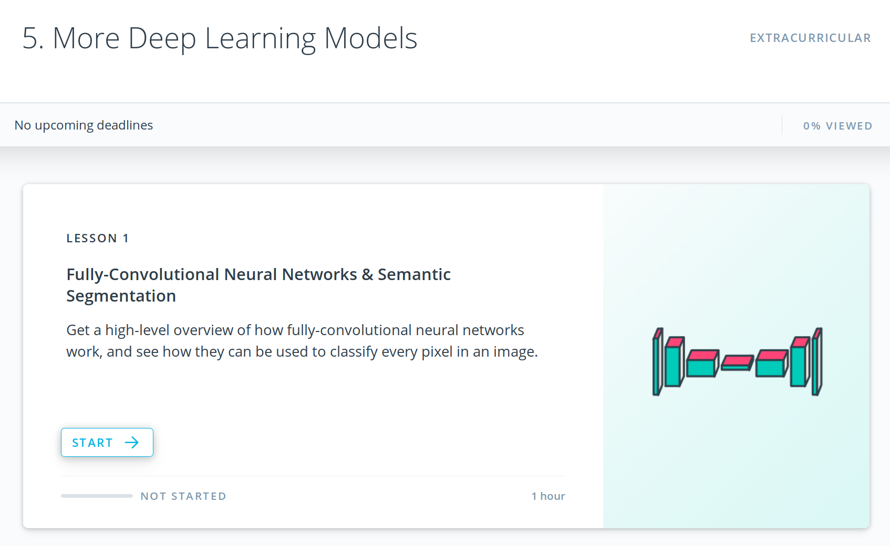

## Day 31: October 24, 2019
- I'm watching all the video lectures of the extracurricular material.
- Today I extensively investigated how to draw vectorial fields in matplotlib.
- I programmed the first version of my vectorial field of rewards for AWS DeepRacer. However, my vectorial field of rewards is not aligned, yet, as you can see in the photo. The deadline for the final race of AWS DeepRacer is close. I need to hurry up!
- I answered some questions in the Slack channel #cvnd_techhelp.
- I encourage @KhushkumarP, @Jacqueline SusanM, @labibaR, @OudarjyaS, @MuhammadN, @Mohamed ChoukriB, @KonstantinosK, @AdityaK, @MahmmoudM, @LauraT, @ElenaK, @HelenaB, @RobO, @ShafaqA, @Nancy A, @TzuhsinC, @TemitopeO, @AarthiA, @NabhanA, @MD BAPPIP, @AnkitV. 

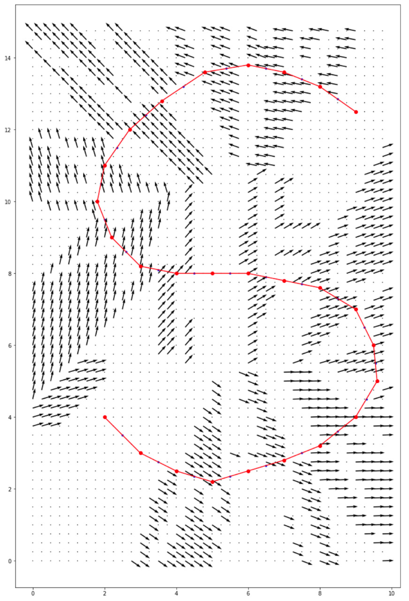

## Day 32: October 25, 2019
- I'm watching all the video lectures of the extracurricular material.
- The deadline for the final race of AWS DeepRacer is close. I need to hurry up!
- I succesfully implemented my vectorial field of rewards for AWS DeepRacer. See the first photo.
- I turned the steering wheel to make the car stay on track. Now my vectorial field of rewards looks like a centipede. I'm a mathematical artist. See the second photo.
- I closed the loop of the track. That wasn't trivial. In fact, I still get errors in the AWS DeepRacer server. See the third photo.
- I answered some questions in the Slack channel #cvnd_techhelp.
- I encourage @KhushkumarP, @Jacqueline SusanM, @labibaR, @OudarjyaS, @MuhammadN, @Mohamed ChoukriB, @KonstantinosK, @AdityaK, @MahmmoudM, @LauraT, @ElenaK, @HelenaB, @RobO, @ShafaqA, @Nancy A, @TzuhsinC, @TemitopeO, @AarthiA, @NabhanA, @MD BAPPIP, @AnkitV. 

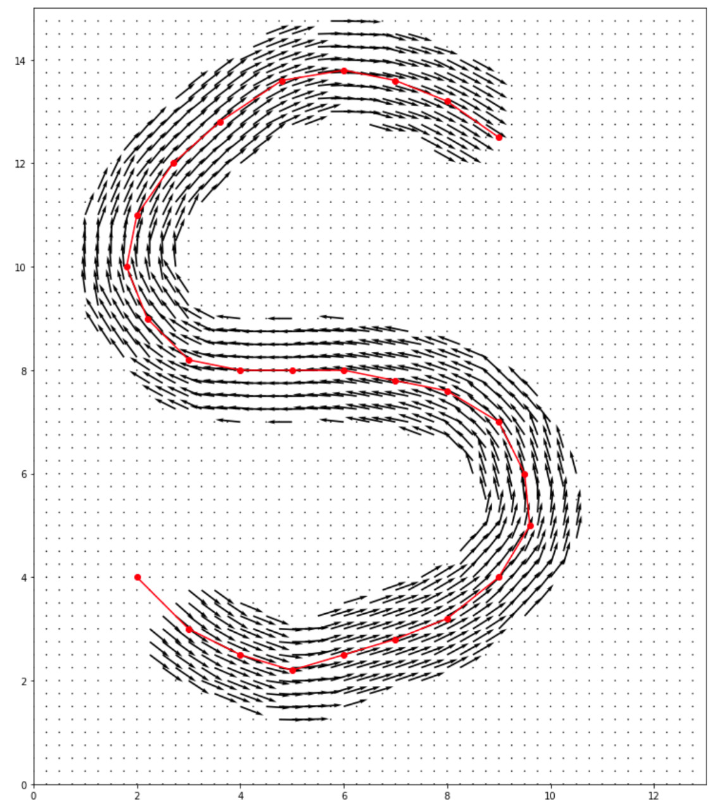
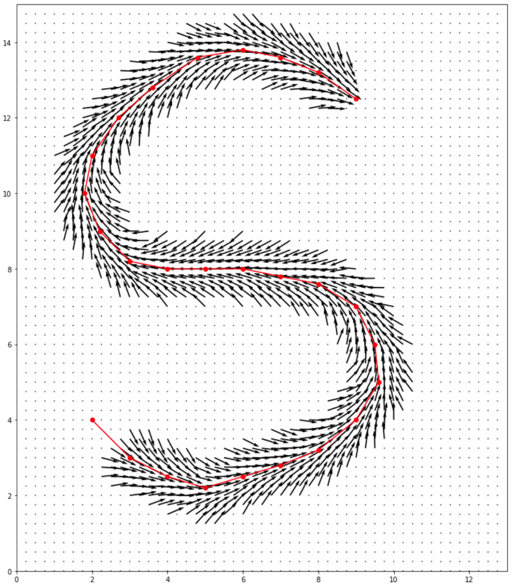
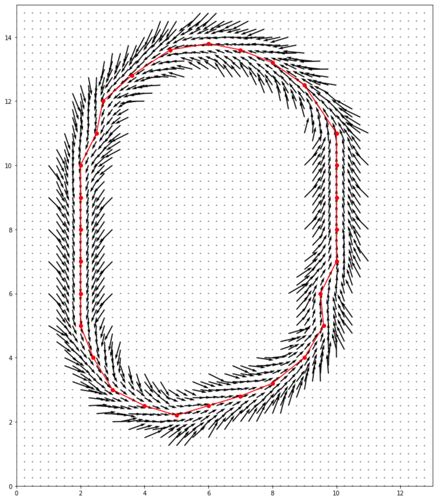

## Day 33: October 26, 2019
- I'm watching all the video lectures of the extracurricular material.
- The deadline for the final race of AWS DeepRacer is close. I need to hurry up!
- Now I implemented my vectorial field of rewards for AWS DeepRacer by using only the 2 indexes provided by `params['closest_waypoints']`. My vectorial field is smooth and continuous. See the photo. I hope to test it soon in my first AWS DeepRacer submission. 
- I answered some questions in the Slack channel #cvnd_techhelp.
- I encourage @KhushkumarP, @Jacqueline SusanM, @labibaR, @OudarjyaS, @MuhammadN, @Mohamed ChoukriB, @KonstantinosK, @AdityaK, @MahmmoudM, @LauraT, @ElenaK, @HelenaB, @RobO, @ShafaqA, @Nancy A, @TzuhsinC, @TemitopeO, @AarthiA, @NabhanA, @MD BAPPIP, @AnkitV. 

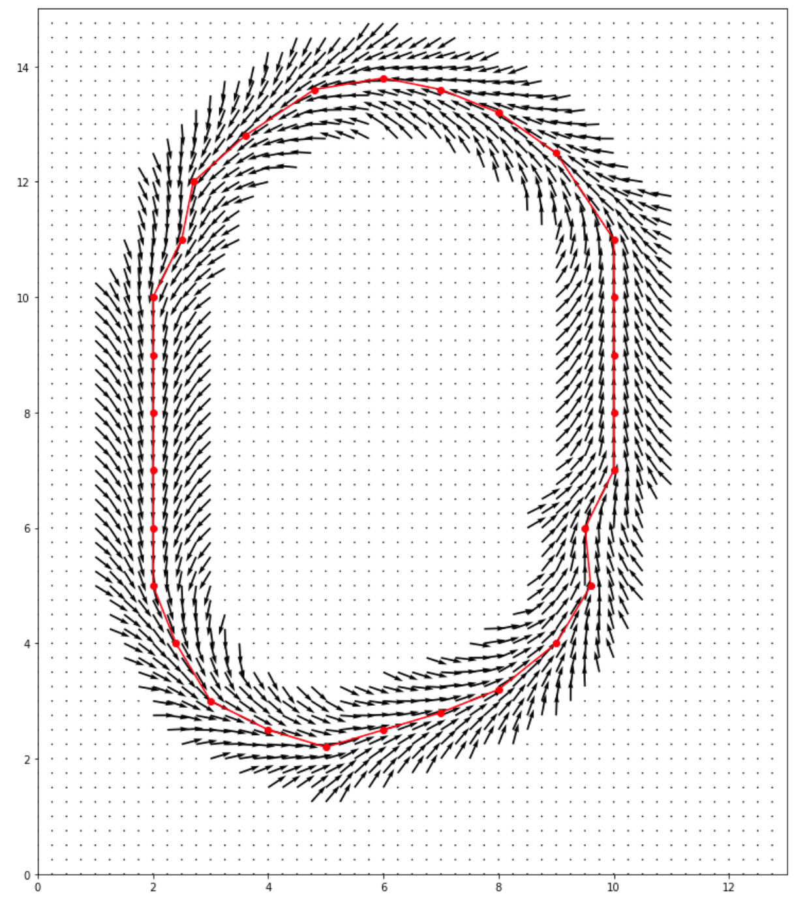

## Day 34: October 27, 2019
- I'm watching all the video lectures of the extracurricular material.
- The deadline for the final race of AWS DeepRacer is close. I need to hurry up!
- I managed to make my first valid submission. Not all submissions are valid. Your car must be able to finish a number of consecutive laps in a complete way. On average, my car finished each lap in 22 seconds. See the photo and the following link: https://aws.amazon.com/deepracer/schedule-and-standings/leaderboard-virtual-toronto-turnpike-2019/?racerName=JuanCarlosKuriPinto
- I answered some questions in the Slack channel #cvnd_techhelp.
- I encourage @KhushkumarP, @Jacqueline SusanM, @labibaR, @OudarjyaS, @MuhammadN, @Mohamed ChoukriB, @KonstantinosK, @AdityaK, @MahmmoudM, @LauraT, @ElenaK, @HelenaB, @RobO, @ShafaqA, @Nancy A, @TzuhsinC, @TemitopeO, @AarthiA, @NabhanA, @MD BAPPIP, @AnkitV. 

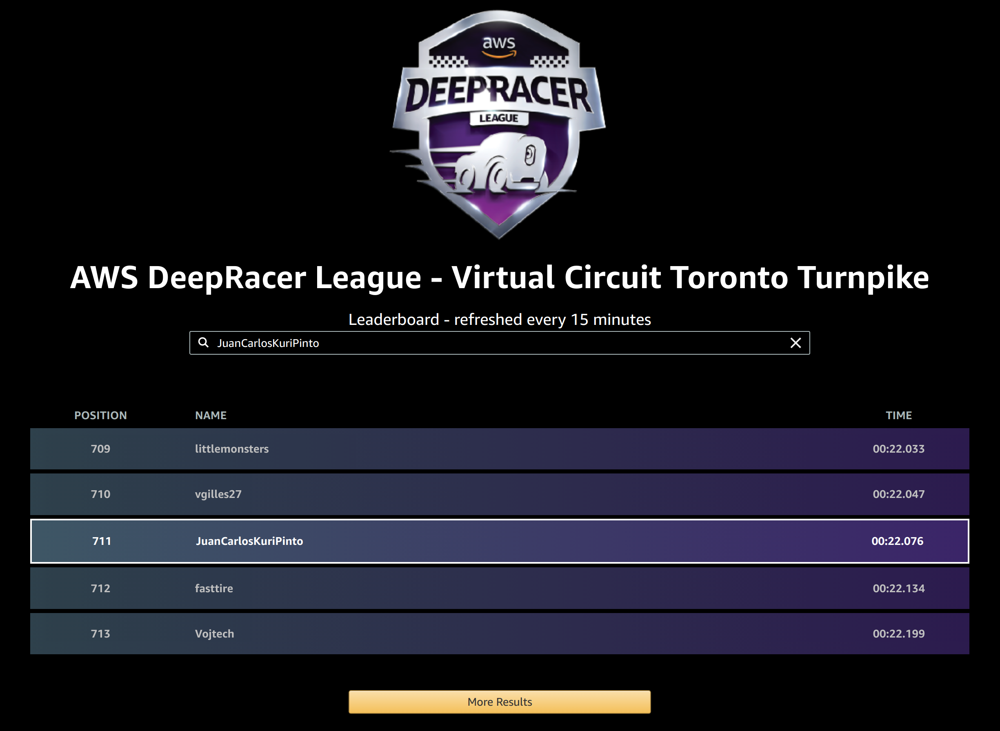

## Day 35: October 28, 2019
- The deadline for the final race of AWS DeepRacer is close. I need to hurry up!
- I continue improving my reward function for AWS DeepRacer. Now I'm ranked #335 with an average time of 14.7 seconds per lap. See the photo and the following link: https://aws.amazon.com/deepracer/schedule-and-standings/leaderboard-virtual-toronto-turnpike-2019/?racerName=JuanCarlosKuriPinto
- I answered some questions in the Slack channel #cvnd_techhelp.
- I encourage @KhushkumarP, @Jacqueline SusanM, @labibaR, @OudarjyaS, @MuhammadN, @Mohamed ChoukriB, @KonstantinosK, @AdityaK, @MahmmoudM, @LauraT, @ElenaK, @HelenaB, @RobO, @ShafaqA, @Nancy A, @TzuhsinC, @TemitopeO, @AarthiA, @NabhanA, @MD BAPPIP, @AnkitV. 

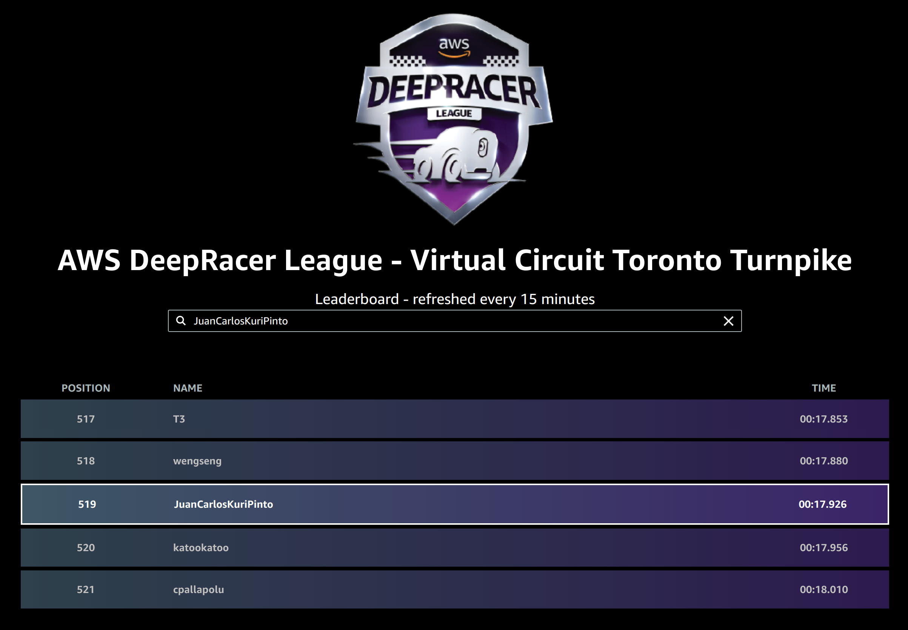

## Day 36: October 29, 2019
- The deadline for the final race of AWS DeepRacer is close. I need to hurry up!
- I'm training a new model whose maximum speed is 10 m/s. Training at high speeds takes a much longer time. After 12 hours of GPU training, my new model starts to show signs of understanding of the problem of driving at high speeds. See the reward graph.
- I answered some questions in the Slack channel #cvnd_techhelp.
- I encourage @KhushkumarP, @Jacqueline SusanM, @labibaR, @OudarjyaS, @MuhammadN, @Mohamed ChoukriB, @KonstantinosK, @AdityaK, @MahmmoudM, @LauraT, @ElenaK, @HelenaB, @RobO, @ShafaqA, @Nancy A, @TzuhsinC, @TemitopeO, @AarthiA, @NabhanA, @MD BAPPIP, @AnkitV. 

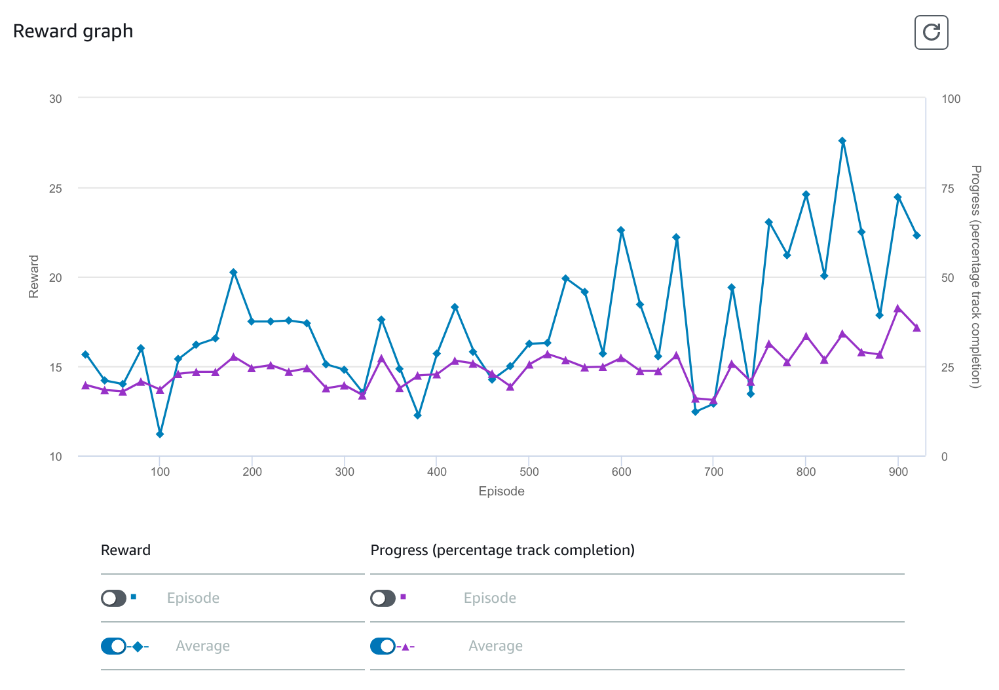
